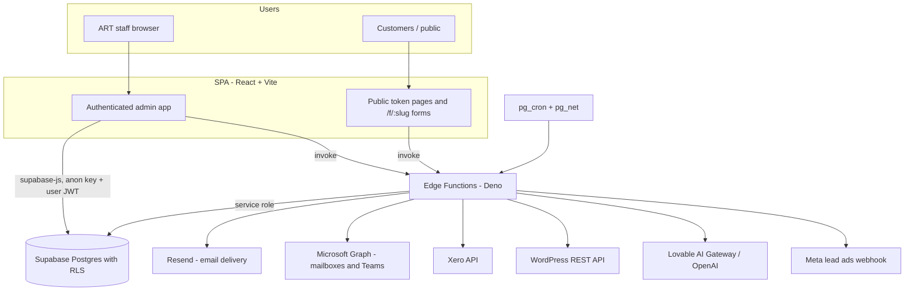

# 01 — Architecture

## What the system is for

ART Admin is the internal operating system for Australian Racing Tours. It runs the whole commercial and operational life of a racing tour:

- Tours, itineraries, hotels, activities, transport, pickups and host briefings
- Bookings, passengers, passports, waivers, rooming, dietary and payment position
- Contacts (customers) and their booking and correspondence history
- CRM: enquiries (leads), stages, ownership, follow-up and outcomes
- ART's own email marketing (campaigns, audiences, tracking, attribution)
- Individual staff correspondence pulled from Microsoft 365 mailboxes
- Task Manager used across every department
- Integrations: Xero (invoices/payments), WordPress (public website), Microsoft Teams, Resend (email delivery), Meta/Zapier lead feeds

## Stack

| Layer | Technology |
| --- | --- |
| UI | React 18, React Router 6, Tailwind CSS 3, shadcn/ui (Radix), lucide icons |
| Build | Vite 5 with `@vitejs/plugin-react-swc`, TypeScript 5 |
| Data access | `@supabase/supabase-js` v2 + TanStack Query v5 |
| Forms/validation | react-hook-form + zod |
| Documents | react-pdf, pdf-lib, html2pdf.js, DOCX generation in an edge function |
| Rich text | react-quill (email/EDM editors) |
| Backend | Supabase Postgres + Auth + Storage + Edge Functions (Deno) |
| Scheduling | `pg_cron` + `pg_net` calling edge functions over HTTP |
| Hosting | Lovable hosting for the SPA; Supabase hosts the API/functions |

There is no separate application server. Everything server-side is either Postgres (functions, triggers, views, RLS) or a Supabase Edge Function.

## Runtime shape

## Key architectural decisions

1. **Postgres is the source of truth for rules.** Stage behaviour, automation, attribution, capacity checks, cascade deletes and reporting are implemented as Postgres functions, triggers and views (`crm_*`, `handle_*`, `check_*`), not in the browser. Reporting screens call RPCs rather than assembling numbers client-side.
2. **Edge functions run with the service role and `verify_jwt = false`.** Almost every function in `supabase/config.toml` sets `verify_jwt = false`; functions verify the caller themselves (a Supabase user token, an opaque customer token, an integration key, or a webhook secret). This was a deliberate choice for reliability with cron and webhooks. See [06-security-rls.md](06-security-rls.md).
3. **Customer-facing pages are token-based, not accounts.** Customers never log in. They get a signed link (`/waiver/:token`, `/update-profile/:token`, `/view-itinerary/:token`, …) validated by a `validate-*-token` function. Access tokens expire in 168 hours (7 days); guest document signed URLs last 28 days.
4. **ART owns its marketing stack.** Campaign sending, audiences, tracking and attribution are built in-house (`marketing_*` tables and `marketing-*` functions). Brevo and Keap were removed entirely in the 2026 tidy-up. This is not a third-party ESP integration.
5. **The website is downstream of ART.** ART is the source of truth for itinerary, inclusions and day photos; WordPress is written to through an allowlisted field map with preview-then-confirm.
6. **Dates are Australian and literal.** `dd/MM/yyyy` display everywhere; date-only values are stored as `yyyy-MM-dd` strings to avoid timezone shifts.

## Where the pressure points are

- Egress and query volume: `customers` (6,637) and `crm_emails` (12,771) are the largest tables; screens are written to fetch tour-scoped slices rather than whole tables.
- Rate limits: Xero (300 ms spacing plus 429 retries) and Resend (sequential sends ~600 ms apart) constrain bulk operations.
- Edge function cold starts and bundling: imports use `esm.sh` rather than `npm:` specifiers to avoid deploy timeouts.
