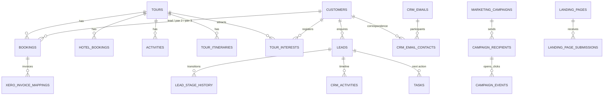

# 04 — Database

Live Supabase Postgres, project ref `upqvgtuxfzsrwjahklij`. 145 public tables, all with row level security enabled, 405 policies, 9 views, and a large body of Postgres functions and triggers.

No client data or personal values appear in this chapter.

## Core domain tables

| Table | Role |
| --- | --- |
| `tours` (72 cols) | The tour/departure record: dates, capacity, pricing, instalments, statuses, welcome message, flights, integration ids, brand, DMC flag |
| `bookings` (37 cols) | A booking against a tour, up to three passengers, room/bedding, status, payment position, automation overrides |
| `customers` (47 cols) | Contacts: identity, address/state, phone, dietary/medical, marketing consent, lifetime value, `latest_tour_name` / `latest_tour_end_date` |
| `hotels`, `hotel_bookings`, `hotel_attachments` | Accommodation inventory, per-booking allocation, contracts |
| `activities`, `activity_bookings`, `activity_journeys`, `activity_attachments` | Activities, per-booking allocation, transport, documents |
| `tour_itineraries` → `tour_itinerary_days` → `tour_itinerary_entries` | Versioned itinerary (`is_current`, `version`), days, entries; `tour_itinerary_day_images` holds up to 3 photos per day |
| `tour_additional_info_sections`, `tour_inclusion_items`, `operations_documents` | Guest document and operations content |
| `booking_travel_docs`, `booking_waivers`, `tour_pickup_options`, `tour_custom_forms*` | Passenger document collection |
| `tasks` and its satellites (`task_assignments`, `task_subtasks`, `task_comments`, `task_watchers`, `task_approvers`, `task_entity_links`, `task_activity_log`, `task_statuses`, `task_templates`) | Task Manager |

## CRM tables

| Table | Role |
| --- | --- |
| `leads` (60 cols) | An enquiry: contact link, tour interest, stage, owner, source, next action, nurture fields, outcome |
| `lead_stage_history` | Every stage transition, written by trigger |
| `crm_lead_stages`, `crm_lead_sources`, `crm_lead_types`, `crm_lost_reasons`, `crm_settings` | Configuration, not code |
| `crm_activities` | Timeline entries |
| `tour_interests` | Contact ↔ tour interest, the basis of tour-level audiences |
| `crm_automation_rules`, `crm_automation_runs` | Nudge/automation rules with cooldowns and run log |
| `crm_emails`, `crm_email_contacts`, `crm_email_links`, `email_mailboxes`, `email_mailbox_access`, `email_sync_runs` | Microsoft 365 correspondence |

## Marketing tables

`marketing_campaigns`, `campaign_recipients`, `campaign_events`, `marketing_audiences`, `marketing_link_classifications`, `marketing_automation_rules`, `marketing_automation_log`, `marketing_preferences`, `edm_templates`, `email_suppressions`, `email_events`, `landing_pages`, `landing_page_submissions` (62 cols — a preserved, immutable copy of exactly what was submitted).

## Integration and platform tables

`xero_integration_settings`, `xero_invoice_mappings`, `xero_payment_receipts`, `xero_sync_log`, `xero_api_locks`, `wordpress_tour_links`, `wordpress_field_mappings`, `wordpress_integration_audit_logs`, `website_change_requests`, `website_change_events`, `lead_integrations`, `lead_integration_tour_map`, `user_teams_connections`, `teams_channel_notify_config`, `backup_runs`, `audit_log`, `brands`, `general_settings`, `profiles`, `user_roles`, `user_departments`.

## Views (all read-only, derived)

| View | Purpose |
| --- | --- |
| `crm_lead_facts`, `crm_lead_activity_facts` | Flattened enquiry state for reporting and automation |
| `crm_contact_booking_facts` | Real booking history per contact (tour, status, dates), cancelled excluded — powers booking audience conditions |
| `crm_contact_nurture_facts` | Existing nurture leads, tours, review dates, reasons |
| `crm_contact_marketing_facts`, `marketing_contact_eligibility` | Engagement facts and consent/suppression eligibility |
| `campaign_event_intent` | Click events classified by meaning |
| `crm_campaign_attribution`, `crm_lead_marketing_signals` | Tracked-chain attribution and marketing signals for automation |

## Notable functions

- **CRM/reporting RPCs:** `crm_pipeline_summary`, `crm_funnel`, `crm_action_board`, `crm_response_performance`, `crm_attribution_performance`, `crm_tour_sales`, `crm_data_quality`, `crm_tour_marketing_intelligence`, `crm_tour_marketing_people`, `crm_audience_match` / `crm_audience_predicate` / `crm_audience_field_kind` / `crm_audience_summary`, `crm_business_days` / `crm_business_hours` / `crm_weekend_days`.
- **Attribution:** `crm_booking_converts_lead`, `crm_link_booking_to_lead` — one booking credits at most one enquiry.
- **Security helpers:** `has_role`, `check_user_role`, `is_crm_staff`, `is_host_for_tour`, `can_read_mailbox`, `can_read_crm_email`, `can_manage_mailboxes`, `agent_assigned_to_booking`, `secure_customer_search`.
- **Capacity and alerts:** `check_hotel_oversold`, `check_activity_oversold`, `monitor_hotel_capacity`, `monitor_activity_capacity`, `refresh_capacity_alerts`, `check_missing_activity_allocations`, `get_activity_allocation_discrepancies`.
- **Lifecycle:** `handle_booking_alerts`, `handle_tour_date_change`, `handle_hotel_date_change`, `queue_status_change_emails`, `auto_archive_completed_tours`, `recompute_customer_latest_tour`, `recompute_customer_lifetime`, `calculate_nights`, `calculate_booking_revenue`.
- **Cascade deletes:** `delete_booking_with_cascade`, `delete_tour_with_cascade`, `delete_booking_simple` — these are the only safe deletion paths; direct row deletes leave orphans.
- **Retention:** `purge_passport_data`, `purge_ai_conversations`.

## Derived vs authoritative

Authoritative: `bookings`, `tours`, `customers`, `leads`, `tasks`, `campaign_recipients`, `campaign_events`, `crm_emails`, `landing_page_submissions`.

Derived (do not edit directly, they are recomputed): `customers.latest_tour_name`, `customers.latest_tour_end_date`, lifetime value fields, `marketing_audiences.last_count`, `tour_alerts`, everything in the views, and all `crm_*` RPC output.

## Relationship sketch

